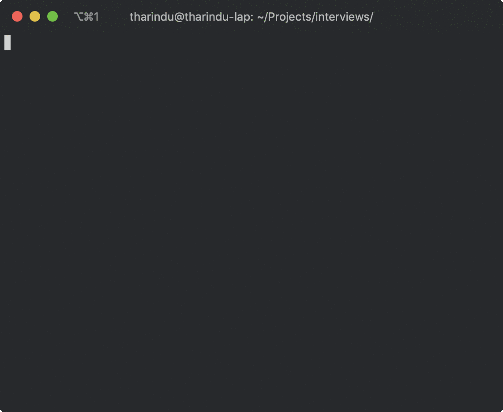

# Python JSON Search

**required python 3 or greater**

## running the program

- using native python3 binary

```bash
cd python-json-search
# install required libraries
pip install -r ./requirements.txt

# run the application using Makefile
make
# or using cli
cd src && python3 main.py
```

- using virtualenv
```bash
cd python-json-search
# create the virtualenv
virtualenv -p /usr/bin/python3 venv
# activate the virtualenv
source venv/bin/activate
# install required libraries
pip install -r ./requirements.txt

# run the application using Makefile
make
# or using cli
cd src && python3 main.py
```

## Application Usage

- users


- tickets
